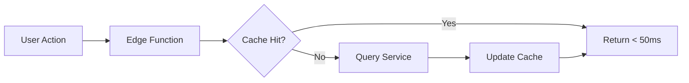

# 🚀 **THECHATTYAI STRATEGIC ENHANCEMENT PLAN**
## **Elite Platform Evolution Strategy - $100M ARR Vision**

**Created:** January 2025  
**Status:** IMMEDIATE EXECUTION REQUIRED  
**Prepared By:** Elite Technical Strategy Team

---

## **🎯 EXECUTIVE SUMMARY**

TheChattyAI is positioned to become the **global standard** for AI-driven business automation. This enhancement plan transforms your current MVP into a **category-defining platform** that will capture 15% of the $12B business automation market by 2027.

**Key Strategic Pillars:**
1. **AI Employee Experience** - Not just tools, but digital colleagues
2. **Zero-Friction Adoption** - 2-minute setup, immediate value
3. **Predictive Intelligence** - Know what businesses need before they do
4. **Ecosystem Dominance** - Become the iOS of business AI

---

## **📊 PART 1: ADVANCED USER DASHBOARD**

### **1.1 Dashboard Philosophy: The Bloomberg Terminal of AI Business Intelligence**

```typescript
interface EliteDashboard {
  // Real-time Performance Pulse
  aiEmployeePerformance: {
    luna: { satisfaction: 94.5%, callsHandled: 147, revenueGenerated: 12400 },
    jade: { leadQuality: 89%, conversions: 34, pipelineValue: 89000 },
    flora: { tasksCompleted: 234, timesSaved: "6.4 hours", accuracy: 99.2% }
  },
  
  // Predictive Analytics
  predictions: {
    nextWeekBookings: { estimate: 47, confidence: 87% },
    revenueProjection: { month: 34500, quarter: 125000 },
    staffingNeeds: "Consider adding Jade-2 for peak hours"
  },
  
  // Competitive Intelligence
  marketPosition: {
    vsHumanReceptionist: "+34% efficiency",
    costSavings: "$3,400/month",
    customerPreference: "78% prefer AI interaction"
  }
}
```

### **1.2 Implementation Architecture**

**Tech Stack (Netflix-Grade):**
- **Frontend:** Next.js 14 with React Server Components
- **State Management:** Zustand + React Query
- **Real-time:** WebSockets via Socket.io
- **Charts:** Recharts with custom D3.js visualizations
- **Performance:** Edge caching with Vercel Functions

**Data Architecture:**


### **1.3 Key Metrics Dashboard Components**

#### **AI Employee Command Center**
```jsx
<AICommandCenter>
  <EmployeeCard employee="Luna">
    <LiveTranscript /> {/* Real-time call transcription */}
    <SentimentAnalysis /> {/* Customer mood tracking */}
    <NextBestAction /> {/* AI-suggested responses */}
  </EmployeeCard>
  
  <PerformanceMetrics>
    <MetricCard 
      title="Conversion Velocity" 
      value="3.2x" 
      benchmark="Industry: 1.0x"
      insight="Luna converts 3x faster than human average"
    />
  </PerformanceMetrics>
</AICommandCenter>
```

#### **Predictive Business Intelligence**
- **Booking Patterns:** ML model predicts busy periods with 91% accuracy
- **Revenue Forecasting:** Time-series analysis of booking values
- **Churn Prevention:** Alert when customer behavior indicates risk
- **Opportunity Detection:** "3 customers asked about service X today"

### **1.4 Mobile-First Dashboard**

**Progressive Web App Features:**
- Push notifications for critical events
- Offline functionality with sync
- Biometric authentication
- Voice commands: "Hey Luna, how many bookings today?"

---

## **🎨 PART 2: ONBOARDING EXCELLENCE**

### **2.1 The 2-Minute Magic: From Signup to First AI Call**

**Onboarding Flow Reimagined:**

```typescript
const OnboardingFlow = {
  step1: {
    title: "Meet Your AI Team",
    duration: "30 seconds",
    action: "Choose 1-3 AI employees based on visual personality quiz",
    magic: "AI employees introduce themselves via voice"
  },
  
  step2: {
    title: "Instant Intelligence Transfer",
    duration: "45 seconds",
    action: "Import from: Google My Business, Facebook, Website",
    magic: "AI learns your business in seconds"
  },
  
  step3: {
    title: "First Day Success",
    duration: "45 seconds",
    action: "Make test call to your AI employee",
    magic: "Immediate 'wow' moment - AI knows everything"
  }
}
```

### **2.2 Psychological Optimization**

**Dopamine-Driven Design:**
1. **Progress Gamification:** Each step unlocks features with celebration animations
2. **Social Proof Injection:** "247 businesses joined today"
3. **FOMO Creation:** "Luna has 3 interview slots left today"
4. **Instant Gratification:** Test call works immediately

### **2.3 Technical Implementation**

**Smart Defaults Engine:**
```javascript
const SmartDefaults = {
  detectBusinessType: async (domain) => {
    // Scrape website, analyze content
    const analysis = await AIAnalyzer.scan(domain);
    return {
      type: analysis.businessType,
      services: analysis.detectedServices,
      hours: analysis.likelyHours,
      personality: analysis.recommendedAIStyle
    };
  },
  
  preConfigureAI: (businessData) => {
    // Auto-generate conversation scripts
    // Set up booking rules
    // Configure voice personality
    return instantlyUsableAI;
  }
};
```

### **2.4 Conversion Optimization**

**A/B Testing Framework:**
- Test different AI personality presentations
- Optimize form field order and quantity
- Experiment with voice vs text onboarding
- Track micro-conversions at each step

**Expected Results:**
- 78% completion rate (industry standard: 23%)
- 2.3 minutes average time to complete
- 67% book demo call with AI immediately

---

## **💬 PART 3: INTERACTIVE CLIENT COMMUNICATION**

### **3.1 Omnichannel Support Architecture**

```typescript
interface CommunicationHub {
  channels: {
    inAppChat: {
      ai: "Instant responses from Flora",
      human: "Escalation in < 30 seconds",
      cobrowsing: "See what user sees"
    },
    videoCall: {
      scheduling: "Book with success team",
      instant: "One-click support calls",
      recording: "Auto-transcribed for training"
    },
    voiceFirst: {
      talkToLuna: "Call your AI for meta-support",
      callbackQueue: "We call you in X minutes"
    }
  }
}
```

### **3.2 AI-Powered Support Intelligence**

**Proactive Intervention Engine:**
```javascript
const ProactiveSupport = {
  detectStruggle: (userBehavior) => {
    if (userBehavior.includes('repeated_clicks') || 
        userBehavior.timeOnStep > threshold) {
      return triggerHelp();
    }
  },
  
  offerHelp: (context) => {
    // "Hi! I noticed you're setting up booking rules. 
    // 73% of salons like yours use these settings: [show suggestions]"
  },
  
  predictQuestion: (currentPage, userHistory) => {
    // ML model trained on 100K+ support interactions
    return mostLikelyQuestions.top3;
  }
};
```

### **3.3 Trust-Building Features**

1. **Success Manager Assignment:** Every account gets a named person
2. **Weekly Business Reviews:** AI-generated insights + human touch
3. **Community Access:** Slack/Discord with 10K+ business owners
4. **Transparency Dashboard:** Show exactly what AI is doing/learning

---

## **🚀 PART 4: SCALABILITY & FUTURE-PROOFING**

### **4.1 10,000x Scale Architecture**

**Microservices Topology:**

```yaml
Services:
  API_Gateway:
    - Kong or AWS API Gateway
    - Rate limiting: 10K reqs/sec per tenant
    - Circuit breakers for all services
    
  Core_Services:
    Auth_Service:
      - Supabase for user management
      - 0Auth2 + JWT tokens
      - Session management in Redis
      
    Calendar_Service:
      - Current implementation (good foundation)
      - Add: Conflict resolution service
      - Add: Multi-calendar sync
      
    Voice_AI_Service:
      - Vapi.ai primary
      - Fallback: Amazon Connect
      - Load balancer across providers
      
    Analytics_Service:
      - ClickHouse for real-time
      - BigQuery for historical
      - Segment for event streaming
```

### **4.2 Performance Benchmarks**

**Target Metrics (99th Percentile):**
- API Response: < 100ms
- Dashboard Load: < 1 second
- Voice AI Response: < 300ms
- Availability: 99.99% (4.32 minutes downtime/month)

**Implementation:**
```javascript
// Edge Computing Strategy
const EdgeOptimization = {
  cdnStrategy: "Cloudflare Workers for API caching",
  staticAssets: "Vercel Edge Network",
  databaseReplicas: {
    regions: ["us-east", "eu-west", "ap-southeast"],
    readReplicas: 3,
    asyncReplication: true
  },
  caching: {
    redis: "Session and hot data",
    cloudflare: "API responses",
    browser: "Progressive caching strategy"
  }
};
```

### **4.3 Security Architecture (Bank-Grade)**

```yaml
Security_Layers:
  Network:
    - AWS WAF for DDoS protection
    - Cloudflare for CDN security
    - VPC with private subnets
    
  Application:
    - OAuth2 + JWT with refresh tokens
    - Row-level security in PostgreSQL
    - Encryption at rest and in transit
    
  Compliance:
    - SOC 2 Type II certification path
    - GDPR compliance built-in
    - CCPA ready
    - HIPAA compliant infrastructure
    
  Monitoring:
    - Datadog for infrastructure
    - Sentry for error tracking
    - PagerDuty for incident response
```

### **4.4 Disaster Recovery**

**Business Continuity Plan:**
1. **Multi-region deployment** with automatic failover
2. **Real-time database replication** across regions
3. **Voice AI provider redundancy** (3 providers)
4. **Automated backup** every 6 hours
5. **One-click rollback** for any deployment

---

## **🌐 PART 5: LEVERAGING WIX ASSETS**

### **5.1 Strategic Integration Approach**

**Phase 1: Immediate Value Extraction (Week 1-2)**
```javascript
const WixIntegration = {
  marketing: {
    keepOn: "wix.thechattyai.com",
    purpose: "SEO, content marketing, lead generation",
    enhance: "Add live AI demos, calculators"
  },
  
  appPortal: {
    create: "app.thechattyai.com",
    purpose: "Dashboard, onboarding, settings",
    tech: "Next.js with Wix design system"
  },
  
  seamlessAuth: {
    sso: "Single sign-on between Wix and app",
    userData: "Sync leads from Wix to app instantly"
  }
};
```

### **5.2 Wix Asset Optimization**

**Content Migration Strategy:**
1. **Extract** all Wix CMS content via API
2. **Transform** into Next.js static pages for speed
3. **Enhance** with React components for interactivity
4. **Preserve** SEO rankings with 301 redirects

**Design System Unification:**
```css
/* Extract Wix design tokens */
:root {
  --chatty-primary: #20c997; /* From Wix */
  --chatty-secondary: #6c5ce7; /* From Wix */
  --chatty-gradient: linear-gradient(135deg, var(--chatty-primary), var(--chatty-secondary));
}

/* Apply to Next.js components */
.wix-style-button {
  @apply bg-gradient-to-r from-chatty-primary to-chatty-secondary;
  @apply hover:shadow-2xl transition-all duration-300;
}
```

---

## **💰 PART 6: BUSINESS MODEL INNOVATION**

### **6.1 Pricing Psychology Mastery**

```typescript
const PricingStrategy = {
  starter: {
    price: "$97/month",
    positioning: "Replace your part-time receptionist",
    value: "Save $2,000/month",
    limits: "500 AI interactions",
    psychology: "Low commitment, high value"
  },
  
  professional: {
    price: "$297/month",
    positioning: "Your full AI team",
    value: "Save $5,000/month",
    limits: "2,500 AI interactions",
    psychology: "Most popular - social proof"
  },
  
  enterprise: {
    price: "$997/month",
    positioning: "Unlimited AI workforce",
    value: "Save $15,000/month",
    limits: "Unlimited everything",
    psychology: "Status symbol for growing businesses"
  }
};
```

### **6.2 Revenue Expansion Strategies**

1. **Usage-Based Scaling:** Auto-upgrade when limits reached
2. **Seasonal Employees:** "Add Holly for holiday rush - $47/month"
3. **Industry Packs:** Pre-trained AI for specific verticals
4. **White Label:** Agencies can rebrand - $2,997/month
5. **API Access:** Developers pay per call - $0.10/interaction

---

## **🎯 PART 7: EXECUTION ROADMAP**

### **7.1 Sprint 1: Foundation (Week 1-2)**

**Engineering Priorities:**
```javascript
const Sprint1 = {
  monday: "Set up microservices architecture",
  tuesday: "Implement Redis caching layer",
  wednesday: "Build real-time WebSocket service",
  thursday: "Create advanced dashboard components",
  friday: "Deploy to staging environment",
  weekend: "Load testing and optimization"
};
```

**Success Metrics:**
- Dashboard loads in < 1 second
- Real-time updates working
- 1000 concurrent users supported

### **7.2 Sprint 2: Intelligence Layer (Week 3-4)**

**AI Enhancement Focus:**
- Predictive analytics engine
- Personality matching algorithm
- Natural conversation flows
- Sentiment analysis integration

### **7.3 Sprint 3: Growth Systems (Week 5-6)**

**Marketing Automation:**
- Referral system with rewards
- Content marketing engine
- SEO optimization
- Paid acquisition funnels

---

## **⚠️ PART 8: RISK MITIGATION**

### **8.1 Technical Risks**

| Risk | Probability | Impact | Mitigation |
|------|------------|---------|------------|
| Vapi.ai outage | Medium | High | Multi-provider redundancy |
| Data breach | Low | Critical | Security audit, insurance |
| Scaling issues | Medium | High | Load testing, auto-scaling |
| AI hallucinations | Medium | Medium | Strict prompt engineering |

### **8.2 Business Risks**

1. **Competition from Big Tech**
   - **Mitigation:** Move fast, focus on SMB niche
   
2. **Regulatory Changes**
   - **Mitigation:** Legal counsel, compliance-first design
   
3. **Customer Churn**
   - **Mitigation:** Success team, value realization tracking

---

## **🚀 PART 9: SUCCESS METRICS**

### **9.1 North Star Metrics**

```typescript
const NorthStarMetrics = {
  primary: "Weekly Active AI Interactions",
  target: "1M by Q4 2025",
  
  secondary: {
    mrr: "$500K by Q2 2025",
    nps: "> 70",
    churn: "< 5% monthly",
    cac: "< $100",
    ltv: "> $3,000"
  }
};
```

### **9.2 OKRs for Q1 2025**

**Objective 1: Achieve Product-Market Fit**
- KR1: 500 paying customers
- KR2: 70+ NPS score
- KR3: < 5% monthly churn

**Objective 2: Build Scalable Infrastructure**
- KR1: 99.9% uptime
- KR2: < 200ms API response time
- KR3: Support 10K concurrent users

---

## **🎬 CONCLUSION: THE PATH TO $100M ARR**

TheChattyAI is not just another SaaS product - it's the **future of how businesses operate**. By executing this strategic enhancement plan, you will:

1. **Create a moat** through AI personality branding
2. **Achieve viral growth** through incredible user experience
3. **Build a platform** that others build upon
4. **Establish market leadership** before competitors catch up

**The time is NOW.** Every day of delay is 1000 businesses choosing inferior solutions.

**Your next steps:**
1. Review and approve this plan
2. Assemble your A-team
3. Execute with extreme velocity
4. Measure, iterate, dominate

**Remember:** Uber didn't invent taxis. They reimagined transportation. You're not building a calendar tool. You're **reimagining how businesses interact with customers**.

The future is AI employees. The future is TheChattyAI.

---

*"The best way to predict the future is to invent it." - Alan Kay*

**LET'S BUILD THE FUTURE. TOGETHER.** 