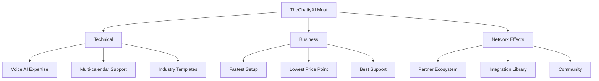

# 🚀 TheChattyAI.com Voice Agent Calendar Integration
## Strategic Master Plan & Expert Analysis

---

## 🎯 Executive Summary

TheChattyAI.com is positioned to become the leading voice AI calendar management platform by offering a seamless, white-label solution that enables businesses to deploy intelligent voice agents capable of handling appointment scheduling through natural conversation.

**Core Value Proposition**: "Transform every business into an AI-powered scheduling powerhouse in under 5 minutes."

---

## 👷 Expert Builder Perspective

### Technical Architecture Enhancement

#### 1. **Current State**
- ✅ Working calendar API with JWT authentication
- ✅ Basic Vapi.ai integration
- ✅ Multi-tenant support via PostgreSQL
- ✅ Google Calendar integration

#### 2. **Immediate Technical Improvements** (Next 2 Weeks)

```javascript
// Priority Features to Build
const priorityFeatures = {
  1: "Webhook system for real-time updates",
  2: "Advanced conflict resolution",
  3: "Time zone auto-detection",
  4: "SMS/Email confirmation system",
  5: "Recurring appointment support",
  6: "Buffer time management",
  7: "Cancellation/rescheduling API",
  8: "Analytics dashboard API"
};
```

#### 3. **Scalability Enhancements**
- **Implement Redis** for caching available slots
- **Add rate limiting** per tenant (prevent abuse)
- **Implement queue system** for appointment processing
- **Add WebSocket support** for real-time updates

#### 4. **Security Hardening**
```yaml
Security_Checklist:
  - Implement API key rotation system
  - Add request signing for webhooks
  - Enable audit logging for all actions
  - Implement GDPR compliance tools
  - Add PCI compliance for future payments
  - Enable 2FA for tenant accounts
```

---

## 📈 Expert GTM (Go-To-Market) Perspective

### Market Positioning Strategy

#### 1. **Target Market Segments** (Prioritized)
| Segment | Market Size | Difficulty | Revenue Potential |
|---------|------------|-----------|------------------|
| Hair Salons & Spas | $150B | Low | $99-299/mo |
| Medical Practices | $200B | Medium | $199-499/mo |
| Fitness Studios | $96B | Low | $79-199/mo |
| Professional Services | $500B | Medium | $149-399/mo |
| Restaurants | $900B | High | $49-149/mo |

#### 2. **Pricing Strategy**
```
Starter Plan: $49/month
- 100 appointments/month
- 1 voice agent
- Basic analytics

Professional: $149/month  
- 500 appointments/month
- 3 voice agents
- Advanced analytics
- Custom greeting

Enterprise: $399/month
- Unlimited appointments
- Unlimited agents
- White-label option
- API access
- Priority support
```

#### 3. **Launch Sequence**
1. **Week 1-2**: Beta launch with 10 hair salons
2. **Week 3-4**: Gather feedback, iterate
3. **Month 2**: Public launch with case studies
4. **Month 3**: Scale to 100 customers
5. **Month 4-6**: Expand to new verticals

#### 4. **Marketing Channels**
- **Direct Sales**: Target local businesses
- **Partner Program**: Vapi.ai partnership
- **Content Marketing**: "AI Voice Revolution" blog
- **Demo Videos**: Industry-specific demos
- **Free Trial**: 14-day full access

---

## 🧠 Expert Strategist Perspective

### Competitive Advantage Framework

#### 1. **Moat Building Strategy**


#### 2. **Strategic Partnerships**
- **Vapi.ai**: Preferred calendar provider
- **Twilio**: Voice infrastructure
- **Google/Microsoft**: Calendar providers
- **Square/Stripe**: Payment integration
- **Industry Associations**: Credibility

#### 3. **Expansion Roadmap**
1. **Phase 1** (0-6 months): Calendar scheduling
2. **Phase 2** (6-12 months): Payment processing
3. **Phase 3** (12-18 months): Full CRM features
4. **Phase 4** (18-24 months): AI business insights

---

## 👔 Expert CEO Perspective

### Vision & Execution Plan

#### 1. **Company Vision**
> "Every business conversation should be intelligent, efficient, and available 24/7. TheChattyAI makes this possible for any business in minutes, not months."

#### 2. **Key Metrics to Track**
```python
key_metrics = {
    "MRR Growth": "50% MoM for first 6 months",
    "Churn Rate": "< 5% monthly",
    "CAC": "< $200 per customer",
    "LTV": "> $2,400 per customer",
    "NPS": "> 50",
    "Time to Value": "< 5 minutes setup"
}
```

#### 3. **Funding Strategy**
- **Bootstrap**: First 100 customers
- **Seed Round**: $1.5M at 1000 customers
- **Series A**: $10M at $100k MRR
- **Strategic Investors**: Vapi.ai, Twilio Ventures

#### 4. **Risk Mitigation**
| Risk | Probability | Impact | Mitigation |
|------|------------|--------|------------|
| Google API changes | Medium | High | Multi-calendar support |
| Vapi.ai dependency | Low | High | Build own voice layer |
| Competition | High | Medium | Fast execution & moat |
| Scaling issues | Medium | Medium | Architecture planning |

---

## 👥 Expert Team Perspective

### Organizational Structure & Hiring Plan

#### 1. **Immediate Hires** (Next 30 Days)
1. **Senior Full-Stack Engineer** ($120-150k)
   - Focus: API scaling & reliability
2. **Customer Success Manager** ($60-80k)
   - Focus: Onboarding & retention
3. **Sales Development Rep** ($40-60k + comm)
   - Focus: Outbound to salons

#### 2. **Team Structure** (6 Months)
```
CEO/Founder
├── CTO (Hire Month 2)
│   ├── Senior Engineers (2)
│   └── DevOps Engineer
├── VP Sales (Hire Month 3)
│   ├── Sales Team (3)
│   └── Customer Success (2)
└── VP Marketing (Hire Month 4)
    ├── Content Marketer
    └── Growth Hacker
```

#### 3. **Culture & Values**
- **Speed**: Ship fast, learn faster
- **Customer Obsession**: Their success is ours
- **Simplicity**: Complex tech, simple UX
- **Ownership**: Everyone owns outcomes
- **Innovation**: Always be improving

---

## 🎯 Immediate Action Plan (Next 7 Days)

### Day 1-2: Technical Foundation
```bash
# Tasks for Developer
1. Deploy enhanced Vapi integration
2. Set up monitoring & alerts
3. Create tenant onboarding API
4. Build webhook system foundation
```

### Day 3-4: First Customers
```bash
# Tasks for Founder
1. Contact 20 local hair salons
2. Offer free setup for first 5
3. Create onboarding video
4. Set up Calendly for demos
```

### Day 5-6: Product Polish
```bash
# Tasks for Team
1. Create industry-specific templates
2. Build simple analytics dashboard
3. Set up customer support system
4. Create documentation site
```

### Day 7: Launch Preparation
```bash
# Launch Checklist
1. ProductHunt submission ready
2. Blog post: "AI Revolution in Scheduling"
3. 5 customer testimonials
4. Pricing page live
5. Demo video published
```

---

## 📊 Success Metrics (First 90 Days)

### Month 1 Goals
- ✅ 10 paying customers
- ✅ $1,000 MRR
- ✅ 5-star reviews from first customers
- ✅ < 10 minute average setup time

### Month 2 Goals  
- ✅ 50 paying customers
- ✅ $5,000 MRR
- ✅ 2 additional verticals launched
- ✅ Partner program launched

### Month 3 Goals
- ✅ 150 paying customers
- ✅ $15,000 MRR
- ✅ Series of case studies published
- ✅ Team of 5 people

---

## 🚀 The Unfair Advantage

### Why TheChattyAI Will Win

1. **First-Mover in Vapi.ai Ecosystem**
   - Become THE calendar solution for Vapi
   - Get featured in their marketplace
   - Co-marketing opportunities

2. **Simplicity as a Moat**
   - Competitors build complex systems
   - We focus on "just works" experience
   - 5-minute setup vs 5-hour setup

3. **Industry-Specific Intelligence**
   - Pre-built conversation flows per industry
   - Understands salon vs medical terminology
   - Custom AI training per vertical

4. **Price Disruption**
   - 10x cheaper than enterprise solutions
   - No setup fees (competitors charge $1000+)
   - Free migration service

---

## 💡 Innovation Pipeline

### Future Features Roadmap
1. **Q1 2025**: Multi-language support (Spanish first)
2. **Q2 2025**: AI-powered no-show prediction
3. **Q3 2025**: Integrated payment processing
4. **Q4 2025**: Full business intelligence suite
5. **2026**: Franchise management system

---

## 📞 Next Steps for Implementation

### For the Technical Team
1. Review and implement `vapi-integration-enhanced.js`
2. Set up staging environment for testing
3. Create API documentation
4. Build admin dashboard

### For the Business Team
1. Create sales collateral
2. Set up CRM system
3. Design onboarding flow
4. Prepare launch campaign

### For the Founder
1. Start customer interviews
2. Refine positioning
3. Build advisor network
4. Prepare funding deck

---

## 🎉 Conclusion

TheChattyAI.com is positioned to capture a massive market opportunity by solving a real pain point with elegant simplicity. By focusing on voice-first experiences and leveraging the Vapi.ai ecosystem, we can build a defensible business that scales efficiently.

**The time is NOW. Let's build the future of business communication together!**

---

*"In 5 years, every business will have an AI voice agent. TheChattyAI will power millions of them."*

**- The TheChattyAI Vision** 