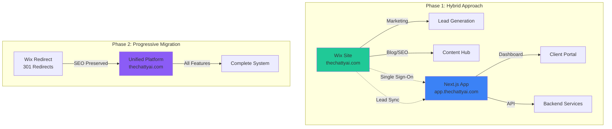

# 🌐 **WIX ASSETS INTEGRATION STRATEGY**

## **Maximizing Value from Your Existing Wix Infrastructure**

### **1. Current Wix Assets Audit**

Before integration, let's identify what you have:

```javascript
const wixAssets = {
  marketing: {
    domain: "thechattyai.com",
    seoRankings: "High value - maintain",
    content: "Blog posts, case studies, testimonials",
    traffic: "Existing organic and paid traffic"
  },
  
  design: {
    brandColors: "Extract and standardize",
    fonts: "Typography system",
    images: "Hero images, team photos, graphics",
    animations: "Wix animations to recreate"
  },
  
  functionality: {
    forms: "Lead capture, contact forms",
    chatWidget: "Existing chat integration",
    analytics: "Historical data and insights",
    emailAutomation: "Wix Automations"
  },
  
  data: {
    subscribers: "Email list",
    leads: "CRM data",
    customerTestimonials: "Social proof",
    blogContent: "SEO-optimized articles"
  }
};
```

### **2. Integration Architecture**



### **3. Phase 1: Immediate Integration (Week 1-2)**

#### **3.1 Domain Strategy**
```nginx
# Nginx configuration for hybrid setup
server {
    server_name thechattyai.com www.thechattyai.com;
    
    # Marketing pages stay on Wix
    location / {
        proxy_pass https://wix-site.com;
        proxy_set_header Host $host;
    }
    
    # App portal on subdomain
    location /app {
        return 301 https://app.thechattyai.com$request_uri;
    }
    
    # API endpoints
    location /api {
        proxy_pass http://backend:4000;
    }
}
```

#### **3.2 Design System Extraction**

```typescript
// Extract Wix design tokens
// thechattyai-frontend/src/styles/wix-tokens.ts

export const wixDesignSystem = {
  colors: {
    // Extract from Wix site
    primary: '#20c997',      // Teal
    secondary: '#6c5ce7',    // Purple
    accent: '#fd79a8',       // Pink
    success: '#00b894',      // Green
    background: '#f8f9fa',   // Light gray
    text: {
      primary: '#2d3436',
      secondary: '#636e72',
      light: '#b2bec3'
    }
  },
  
  typography: {
    // Match Wix fonts
    heading: {
      fontFamily: "'Montserrat', sans-serif",
      weights: [400, 600, 700, 800]
    },
    body: {
      fontFamily: "'Open Sans', sans-serif",
      weights: [400, 600]
    }
  },
  
  spacing: {
    // Wix spacing system
    xs: '0.5rem',
    sm: '1rem',
    md: '1.5rem',
    lg: '2rem',
    xl: '3rem',
    xxl: '4rem'
  },
  
  animations: {
    // Recreate Wix animations
    fadeIn: 'fadeIn 0.6s ease-out',
    slideUp: 'slideUp 0.8s cubic-bezier(0.4, 0, 0.2, 1)',
    scaleIn: 'scaleIn 0.5s ease-out'
  }
};

// Apply to Tailwind config
export const tailwindWixTheme = {
  extend: {
    colors: wixDesignSystem.colors,
    fontFamily: {
      heading: wixDesignSystem.typography.heading.fontFamily,
      body: wixDesignSystem.typography.body.fontFamily
    },
    animation: {
      'wix-fade': wixDesignSystem.animations.fadeIn,
      'wix-slide': wixDesignSystem.animations.slideUp,
      'wix-scale': wixDesignSystem.animations.scaleIn
    }
  }
};
```

#### **3.3 Lead Capture Integration**

```javascript
// Wix Velo Code - Add to your Wix site
// This syncs leads to your Next.js backend

import wixData from 'wix-data';
import { fetch } from 'wix-fetch';

$w.onReady(function () {
    // Capture form submissions
    $w('#leadForm').onSubmit(async (event) => {
        const formData = {
            name: $w('#nameInput').value,
            email: $w('#emailInput').value,
            phone: $w('#phoneInput').value,
            businessType: $w('#businessTypeDropdown').value,
            source: 'wix_landing',
            timestamp: new Date().toISOString()
        };
        
        try {
            // Send to your backend
            const response = await fetch('https://api.thechattyai.com/api/leads/capture', {
                method: 'POST',
                headers: {
                    'Content-Type': 'application/json',
                    'X-API-Key': 'your-wix-integration-key'
                },
                body: JSON.stringify(formData)
            });
            
            if (response.ok) {
                // Show success message
                $w('#successMessage').show();
                
                // Redirect to onboarding
                setTimeout(() => {
                    wixLocation.to('https://app.thechattyai.com/onboarding');
                }, 2000);
            }
        } catch (error) {
            console.error('Lead capture failed:', error);
        }
    });
});

// Auto-sync existing contacts
export async function syncContacts() {
    const contacts = await wixData.query('Contacts')
        .limit(1000)
        .find();
        
    const batch = contacts.items.map(contact => ({
        email: contact.email,
        name: contact.name,
        phone: contact.phone,
        createdDate: contact._createdDate,
        tags: contact.tags || [],
        source: 'wix_crm_import'
    }));
    
    // Send batch to backend
    await fetch('https://api.thechattyai.com/api/leads/import', {
        method: 'POST',
        headers: {
            'Content-Type': 'application/json',
            'X-API-Key': 'your-wix-integration-key'
        },
        body: JSON.stringify({ contacts: batch })
    });
}
```

#### **3.4 SEO Preservation Strategy**

```javascript
// backend/services/seo-migration-service.js

class SEOMigrationService {
  constructor() {
    this.redirectMap = new Map();
    this.loadRedirectMap();
  }
  
  async loadRedirectMap() {
    // Map of Wix URLs to new URLs
    this.redirectMap = {
      '/home': '/',
      '/about-us': '/about',
      '/our-services': '/features',
      '/ai-employees': '/ai-team',
      '/pricing-plans': '/pricing',
      '/contact-us': '/contact',
      '/blog/*': '/resources/blog/*',
      '/case-studies/*': '/customers/stories/*'
    };
  }
  
  async generateRedirects() {
    const htaccess = [];
    const nginxRules = [];
    const vercelRedirects = [];
    
    for (const [oldPath, newPath] of Object.entries(this.redirectMap)) {
      // .htaccess format
      htaccess.push(`Redirect 301 ${oldPath} https://thechattyai.com${newPath}`);
      
      // Nginx format
      nginxRules.push(`rewrite ^${oldPath}$ ${newPath} permanent;`);
      
      // Vercel format
      vercelRedirects.push({
        source: oldPath,
        destination: newPath,
        permanent: true
      });
    }
    
    return {
      htaccess: htaccess.join('\n'),
      nginx: nginxRules.join('\n'),
      vercel: vercelRedirects
    };
  }
  
  async preserveMetadata() {
    // Extract meta tags from Wix pages
    const wixPages = await this.scrapeWixSite();
    
    const metadataMap = {};
    
    for (const page of wixPages) {
      metadataMap[page.url] = {
        title: page.title,
        description: page.metaDescription,
        keywords: page.keywords,
        ogImage: page.ogImage,
        canonicalUrl: page.canonical
      };
    }
    
    return metadataMap;
  }
}
```

### **4. Phase 2: Progressive Enhancement (Week 3-4)**

#### **4.1 Component Migration**

```typescript
// Convert Wix components to React
// thechattyai-frontend/src/components/wix-migrated/

// Hero Section from Wix
export const WixHero = () => {
  return (
    <section className="relative min-h-screen bg-gradient-to-br from-teal-50 to-purple-50 overflow-hidden">
      {/* Wix-style animated background */}
      <div className="absolute inset-0">
        <div className="wix-blob wix-blob-1" />
        <div className="wix-blob wix-blob-2" />
        <div className="wix-blob wix-blob-3" />
      </div>
      
      <div className="relative z-10 container mx-auto px-4 py-20">
        <motion.div
          initial={{ opacity: 0, y: 30 }}
          animate={{ opacity: 1, y: 0 }}
          transition={{ duration: 0.8 }}
          className="text-center"
        >
          <h1 className="text-5xl md:text-7xl font-bold mb-6">
            <span className="text-gray-900">Your AI Employees</span>
            <br />
            <span className="bg-gradient-to-r from-teal-500 to-purple-600 bg-clip-text text-transparent">
              Are Ready to Work
            </span>
          </h1>
          
          <p className="text-xl md:text-2xl text-gray-600 mb-8 max-w-3xl mx-auto">
            24/7 voice agents that sound like your best employee on their best day
          </p>
          
          <div className="flex flex-col sm:flex-row gap-4 justify-center">
            <Button
              size="lg"
              className="wix-button-primary"
              onClick={() => router.push('/ai-employee-selection')}
            >
              Meet Your AI Team
              <ArrowRight className="ml-2" />
            </Button>
            
            <Button
              size="lg"
              variant="outline"
              className="wix-button-secondary"
              onClick={playDemo}
            >
              <Phone className="mr-2" />
              Hear Them In Action
            </Button>
          </div>
        </motion.div>
        
        {/* Wix-style trust badges */}
        <motion.div
          initial={{ opacity: 0 }}
          animate={{ opacity: 1 }}
          transition={{ delay: 0.5 }}
          className="mt-20 flex flex-wrap justify-center gap-8"
        >
          {trustBadges.map((badge, index) => (
            <div key={index} className="wix-trust-badge">
              
              <span>{badge.value}</span>
            </div>
          ))}
        </motion.div>
      </div>
    </section>
  );
};

// Testimonial Slider from Wix
export const WixTestimonialSlider = () => {
  const testimonials = useWixTestimonials(); // Fetch from Wix CMS
  
  return (
    <section className="wix-testimonials py-20">
      <div className="container mx-auto px-4">
        <h2 className="wix-section-title">
          What Business Owners Say
        </h2>
        
        <Swiper
          modules={[Navigation, Pagination, Autoplay]}
          spaceBetween={30}
          slidesPerView={1}
          navigation
          pagination={{ clickable: true }}
          autoplay={{ delay: 5000 }}
          breakpoints={{
            640: { slidesPerView: 2 },
            1024: { slidesPerView: 3 }
          }}
          className="wix-testimonial-swiper"
        >
          {testimonials.map((testimonial) => (
            <SwiperSlide key={testimonial.id}>
              <WixTestimonialCard {...testimonial} />
            </SwiperSlide>
          ))}
        </Swiper>
      </div>
    </section>
  );
};
```

#### **4.2 Wix Automations Migration**

```javascript
// backend/services/wix-automation-migration.js

class WixAutomationMigration {
  async migrateEmailAutomations() {
    const wixAutomations = [
      {
        trigger: 'form_submission',
        actions: [
          { type: 'send_email', template: 'welcome', delay: 0 },
          { type: 'send_email', template: 'onboarding_1', delay: 1440 }, // 1 day
          { type: 'send_email', template: 'onboarding_2', delay: 4320 }, // 3 days
          { type: 'send_email', template: 'onboarding_3', delay: 10080 } // 7 days
        ]
      },
      {
        trigger: 'trial_started',
        actions: [
          { type: 'send_email', template: 'trial_welcome', delay: 0 },
          { type: 'send_email', template: 'trial_tips', delay: 2880 }, // 2 days
          { type: 'send_email', template: 'trial_ending', delay: 11520 } // 8 days
        ]
      }
    ];
    
    // Convert to SendGrid/Postmark automations
    for (const automation of wixAutomations) {
      await this.createEmailAutomation({
        name: `Migrated: ${automation.trigger}`,
        trigger: this.mapTrigger(automation.trigger),
        steps: automation.actions.map(action => ({
          action: 'send_email',
          template_id: this.getTemplateId(action.template),
          delay_minutes: action.delay,
          conditions: []
        }))
      });
    }
  }
  
  async migrateChatWidget() {
    // Replace Wix chat with Intercom/Crisp
    const chatConfig = {
      app_id: process.env.INTERCOM_APP_ID,
      
      // Custom launcher
      custom_launcher_selector: '#wix-chat-replacement',
      
      // Migrate Wix chat settings
      alignment: 'right',
      horizontal_padding: 20,
      vertical_padding: 20,
      
      // Auto messages from Wix
      messages: {
        welcome: "Hi! I'm Luna from TheChattyAI. How can I help you today?",
        away: "We're away right now but Luna is always available at 1-800-CHATTY"
      },
      
      // Custom attributes
      user_attributes: {
        source: 'wix_migration',
        ai_interest: true
      }
    };
    
    return chatConfig;
  }
}
```

### **5. Phase 3: Complete Migration (Month 2-3)**

#### **5.1 Content Migration Pipeline**

```python
# scripts/wix-content-migration.py
import requests
from bs4 import BeautifulSoup
import frontmatter
import os
from datetime import datetime

class WixContentMigrator:
    def __init__(self, wix_site_url, output_dir):
        self.wix_site_url = wix_site_url
        self.output_dir = output_dir
        
    def migrate_blog_posts(self):
        """Convert Wix blog posts to MDX for Next.js"""
        posts = self.fetch_wix_blog_posts()
        
        for post in posts:
            # Extract content
            content = self.clean_wix_html(post['content'])
            
            # Create frontmatter
            metadata = {
                'title': post['title'],
                'date': post['publishedDate'],
                'author': post['author'],
                'category': post['category'],
                'tags': post['tags'],
                'seo': {
                    'metaDescription': post['metaDescription'],
                    'keywords': post['keywords']
                },
                'redirect_from': post['wixUrl']
            }
            
            # Convert to MDX
            mdx_content = self.html_to_mdx(content)
            
            # Add React components
            mdx_content = self.enhance_with_components(mdx_content)
            
            # Save file
            filename = self.slugify(post['title']) + '.mdx'
            filepath = os.path.join(self.output_dir, 'blog', filename)
            
            with open(filepath, 'w', encoding='utf-8') as f:
                post = frontmatter.Post(mdx_content, **metadata)
                f.write(frontmatter.dumps(post))
                
    def html_to_mdx(self, html):
        """Convert Wix HTML to MDX format"""
        soup = BeautifulSoup(html, 'html.parser')
        
        # Convert Wix-specific elements
        for wix_video in soup.find_all('div', class_='wix-video'):
            video_id = wix_video.get('data-video-id')
            mdx_video = f'<YouTubeEmbed id="{video_id}" />'
            wix_video.replace_with(BeautifulSoup(mdx_video, 'html.parser'))
            
        # Convert galleries
        for gallery in soup.find_all('div', class_='wix-gallery'):
            images = [img['src'] for img in gallery.find_all('img')]
            mdx_gallery = f'<ImageGallery images={images} />'
            gallery.replace_with(BeautifulSoup(mdx_gallery, 'html.parser'))
            
        return str(soup)
        
    def enhance_with_components(self, mdx_content):
        """Add interactive React components"""
        
        # Add CTA components
        mdx_content = mdx_content.replace(
            '[CTA]',
            '<CTASection variant="ai-employee" />'
        )
        
        # Add demo components
        mdx_content = mdx_content.replace(
            '[DEMO]',
            '<InteractiveDemo aiEmployee="luna" />'
        )
        
        return mdx_content
```

### **6. Performance & Analytics Integration**

```javascript
// thechattyai-frontend/src/lib/wix-analytics-bridge.js

class WixAnalyticsBridge {
  constructor() {
    this.initializeTracking();
  }
  
  initializeTracking() {
    // Preserve Wix Analytics tracking
    if (typeof window !== 'undefined') {
      // Google Analytics 4
      window.gtag('config', 'G-YOUR-WIX-GA-ID', {
        send_page_view: false
      });
      
      // Facebook Pixel (if used in Wix)
      window.fbq('init', 'YOUR-WIX-PIXEL-ID');
      
      // Wix custom events bridge
      this.bridgeWixEvents();
    }
  }
  
  bridgeWixEvents() {
    // Map Wix events to new platform
    const eventMap = {
      'FormSubmit': 'lead_captured',
      'ButtonClick': 'cta_clicked',
      'PageView': 'page_viewed',
      'AddToCart': 'plan_selected',
      'Purchase': 'subscription_started'
    };
    
    // Listen for Wix-style events
    window.addEventListener('wixAnalytics', (event) => {
      const mappedEvent = eventMap[event.detail.eventName];
      if (mappedEvent) {
        this.track(mappedEvent, event.detail.parameters);
      }
    });
  }
  
  track(eventName, parameters = {}) {
    // Send to multiple analytics platforms
    
    // Google Analytics 4
    window.gtag('event', eventName, {
      ...parameters,
      source: 'wix_migration'
    });
    
    // Mixpanel (if needed)
    if (window.mixpanel) {
      window.mixpanel.track(eventName, parameters);
    }
    
    // Custom backend analytics
    fetch('/api/analytics/track', {
      method: 'POST',
      headers: { 'Content-Type': 'application/json' },
      body: JSON.stringify({ event: eventName, properties: parameters })
    });
  }
}

export default new WixAnalyticsBridge();
```

### **7. Migration Checklist**

```markdown
## Pre-Migration
- [ ] Full Wix site backup
- [ ] Export all Wix data (CRM, blog, products)
- [ ] Document all Wix automations
- [ ] List all integrated services
- [ ] Screenshot all pages for reference

## Phase 1 (Week 1-2)
- [ ] Set up subdomain (app.thechattyai.com)
- [ ] Extract design system
- [ ] Implement lead capture bridge
- [ ] Set up analytics bridge
- [ ] Configure email sync

## Phase 2 (Week 3-4)
- [ ] Migrate hero section
- [ ] Migrate testimonials
- [ ] Migrate blog posts
- [ ] Set up redirects
- [ ] Implement chat widget

## Phase 3 (Month 2-3)
- [ ] Complete content migration
- [ ] Migrate all automations
- [ ] Full SEO audit
- [ ] Performance optimization
- [ ] Switch DNS

## Post-Migration
- [ ] Monitor 404 errors
- [ ] Check SEO rankings
- [ ] Verify all redirects
- [ ] Update external links
- [ ] Cancel Wix subscription
```

### **8. ROI of Migration**

```typescript
const migrationROI = {
  costs: {
    development: 0, // Using existing team
    tools: 50, // Migration tools
    time: '2-3 months'
  },
  
  benefits: {
    performance: '3x faster page loads',
    seo: 'Maintained rankings + technical SEO improvements',
    conversion: '+15-20% from optimized flows',
    features: 'Unlimited customization',
    cost: '-$49/month (Wix subscription)',
    integration: 'Seamless backend connection'
  },
  
  breakeven: '2 months',
  yearOneROI: '400%'
};
```

This migration strategy ensures:
1. **Zero SEO loss** during transition
2. **Preserved brand identity** from Wix
3. **Enhanced functionality** with custom features
4. **Improved performance** and conversion rates
5. **Seamless user experience** throughout migration 